# 🖥️ Windows-Linux Infrastructure Lab

<div align="center">


**A hybrid Windows-Linux infrastructure lab simulating a real-world enterprise environment — featuring Active Directory, DNS, DHCP, Group Policy, and hardened SSH key-based authentication, all virtualised on VMware Workstation.**

</div>

---

## 📌 Project Overview

This lab replicates the core infrastructure stack found in small-to-medium enterprise environments. Using **VMware Workstation Pro** as the hypervisor, a fully functional domain environment was built from scratch — covering Windows Server services, client domain integration, and a hardened Linux server communicating within the same network.

> 💡 *Every service was configured manually through GUI and PowerShell — no pre-built templates or snapshots. The goal was to understand how each component works and how they interact in a real enterprise environment.*

---

## 🏗️ Lab Architecture

```
┌──────────────────────────────────────────────────────┐
│              VMware Workstation Pro                  │
│                                                      │
│  ┌──────────────────────┐   ┌─────────────────────┐  │
│  │  Windows Server 2022 │   │   Ubuntu 24.04 LTS  │  │
│  │  ─────────────────   │   │  ───────────────────│  │
│  │  • Domain Controller │   │  • OpenSSH Server   │  │
│  │  • AD DS             │   │  • ED25519 Key Auth │  │
│  │  • DNS Server        │   │  • Domain Network   │  │
│  │  • DHCP Server       │   │    Member           │  │
│  │  • Group Policy      │   │                     │  │
│  └──────────────────────┘   └─────────────────────┘  │
│                                                      │
│  ┌─────────────────────┐                             │
│  │   Windows 11 Client │                             │
│  │  ─────────────────  │                             │
│  │  • Domain Joined    │                             │
│  │  • GPO Applied      │                             │
│  │  • DHCP Client      │                             │
│  └─────────────────────┘                             │
│                                                      │
│         [ VMware NAT / Internal Network ]            │
└──────────────────────────────────────────────────────┘
```

---

## 🛠️ Technologies Used

| Tool / Technology | Version | Role |
|---|---|---|
| VMware Workstation Pro | Latest | Hypervisor / Lab environment |
| Windows Server | 2022 | Domain Controller, DNS, DHCP |
| Windows | 11 | Domain-joined client |
| Ubuntu Server | 24.04 LTS | Linux infrastructure node |
| PowerShell | 5.1 / 7+ | Automation and configuration |
| OpenSSH | Latest | Secure remote access |

---

## ⚙️ Services Implemented

### 1. 🏢 Active Directory Domain Services (AD DS)

Deployed and configured a Windows Server 2022 Domain Controller from scratch.

- Promoted server to Domain Controller
- Created a new AD forest and domain
- Configured domain functional level
- Verified replication and SYSVOL health via `dcdiag` and `repadmin`

---

### 2. 🗂️ Organisational Units & User Management

Designed an OU structure mirroring a real corporate hierarchy for logical user and computer management.

```
Domain
├── OU: IT Department
│   ├── Users
│   └── Computers
├── OU: HR Department
│   ├── Users
│   └── Computers
├── OU: Finance Department
│   ├── Users
│   └── Computers
└── OU: Servers
```

**User management tasks performed:**
- Created department users with standardised naming conventions
- Assigned users to security groups
- Set password policies and account properties
- Managed group memberships for resource access

---

### 3. 🌐 DNS — Forward & Reverse Lookup Zones

Configured Windows DNS Server to support both name resolution and reverse lookups across the domain.

| Zone Type | Purpose |
|-----------|---------|
| Forward Lookup Zone | Hostname → IP resolution |
| Reverse Lookup Zone | IP → Hostname resolution (PTR records) |

- Created A records for all servers and clients
- Created PTR records for reverse lookups
- Configured DNS forwarders for external name resolution
- Verified with `nslookup` and `Resolve-DnsName`

---

### 4. 📡 DHCP — Scopes & Reservations

Set up centralised DHCP services on Windows Server to automate IP address management.

| Configuration | Detail |
|---|---|
| Scope | `192.168.10.0/24` |
| Default Gateway | `192.168.10.1` |
| DNS Server | Domain Controller IP |
| Lease Duration | 8 hours |
| Exclusion Range | `192.168.10.1 – 192.168.10.20` (static devices) |

- Created DHCP scope with exclusions for static infrastructure
- Configured DHCP reservations for servers and printers by MAC address
- Authorised DHCP server in Active Directory
- Verified lease assignments with `Get-DhcpServerv4Lease`

---

### 5. 📋 Group Policy Objects (GPO)

Created and linked GPOs to enforce security and configuration standards across the domain.

| GPO Name | Scope | Purpose |
|----------|-------|---------|
| Password Policy | Domain | Enforce complexity, length, and expiry |
| Desktop Wallpaper | All Users OU | Standardise corporate wallpaper |
| USB Drive Restriction | IT Dept OU | Block removable storage |
| Software Restriction | Finance OU | Limit application execution |
| Screen Lock Policy | Domain | Auto-lock after 5 minutes |

- Linked GPOs at domain and OU level
- Tested GPO application with `gpupdate /force` and `gpresult /r`
- Verified inheritance and precedence using GPMC

---

### 6. 💻 Domain-Joined Windows 11 Client

Joined a Windows 11 machine to the domain and validated the full AD integration.

- Configured static DNS pointing to Domain Controller
- Joined machine to domain and placed in correct OU
- Logged in with domain user accounts
- Verified GPO application on the client
- Tested access to domain resources

---

### 7. 🐧 Ubuntu Networking Configuration

Configured Ubuntu 24.04 LTS with static networking to operate within the lab domain network.

- Configured static IP via Netplan (`/etc/netplan/`)
- Set DNS to Windows Server Domain Controller
- Verified name resolution for domain resources
- Configured `/etc/hosts` for local hostname mappings
- Tested connectivity to domain controller and Windows client

---

### 8. 🔐 OpenSSH with ED25519 Key-Based Authentication

Hardened the Ubuntu server's SSH configuration — replacing password authentication with cryptographically stronger ED25519 key pairs.

**Why ED25519 over RSA?**
- Shorter key with stronger security
- Faster key generation and connection
- Resistant to side-channel attacks
- Industry-recommended for modern SSH deployments

**Configuration steps performed:**
- Generated ED25519 key pair on client machine
- Deployed public key to `~/.ssh/authorized_keys` on Ubuntu server
- Hardened `/etc/ssh/sshd_config`:
  ```
  PasswordAuthentication no
  PubkeyAuthentication yes
  PermitRootLogin no
  AuthorizedKeysFile .ssh/authorized_keys
  ```
- Restarted SSH service and verified key-based login
- Tested that password login is correctly rejected

---

## 🔎 Key Verification Commands

```powershell
# Active Directory
Get-ADUser -Filter * | Select Name, SamAccountName     # List all AD users
Get-ADOrganizationalUnit -Filter *                      # List all OUs
dcdiag /test:replications                               # Check AD replication health

# DNS
nslookup <hostname>                                     # Forward lookup test
nslookup <IP-address>                                   # Reverse lookup test
Get-DnsServerZone                                       # List all DNS zones

# DHCP
Get-DhcpServerv4Scope                                   # View DHCP scopes
Get-DhcpServerv4Lease -ScopeId 192.168.10.0            # View active leases
Get-DhcpServerv4Reservation -ScopeId 192.168.10.0      # View reservations

# Group Policy
gpupdate /force                                         # Force GPO refresh
gpresult /r                                             # Show applied GPOs
Get-GPO -All                                            # List all GPOs
```

```bash
# Ubuntu / SSH
ip addr show                          # Verify network configuration
ssh -i ~/.ssh/id_ed25519 user@server  # Connect using ED25519 key
sudo systemctl status ssh             # Check SSH service status
sudo sshd -T | grep -i password       # Verify password auth is disabled
```

---

## 🖼️ Verification Screenshots

| Component | Screenshot |
|-----------|-----------|
| VMware Lab Inventory | 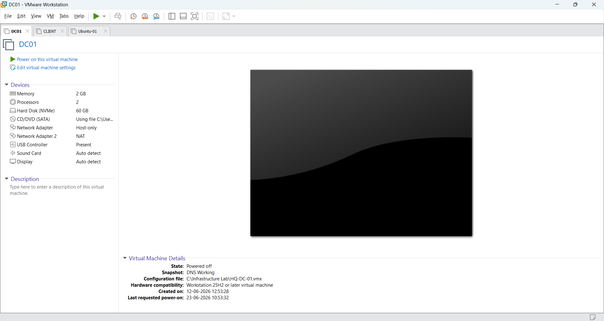 |
| Active Directory Users & Computers | 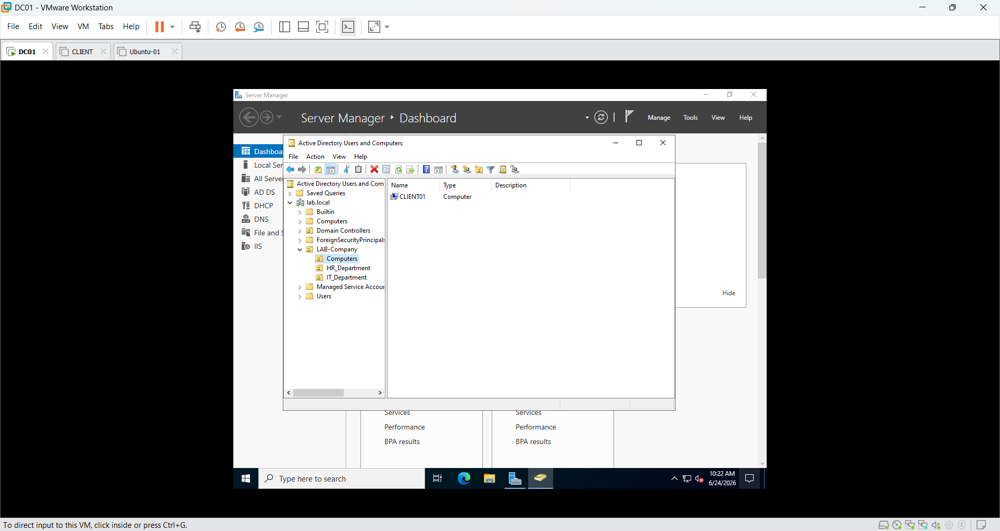 |
| Windows Client Domain Join | 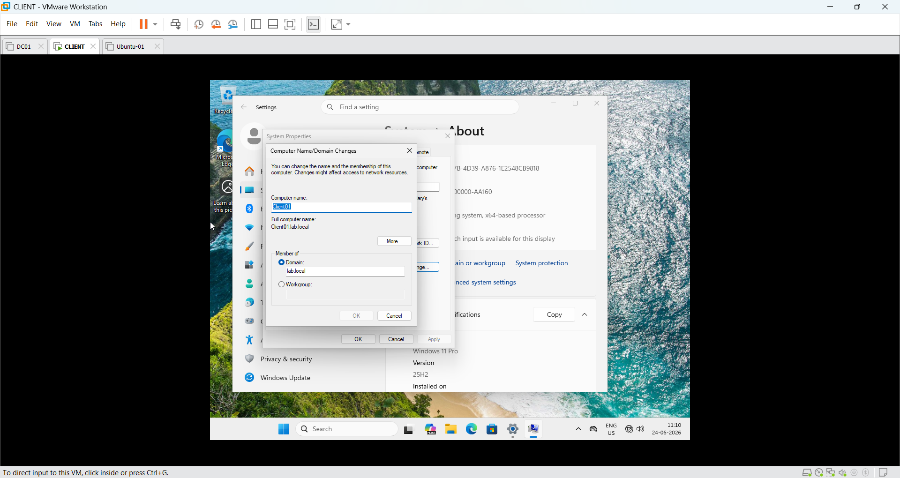 |
| DNS Manager (Forward & Reverse Zones) | 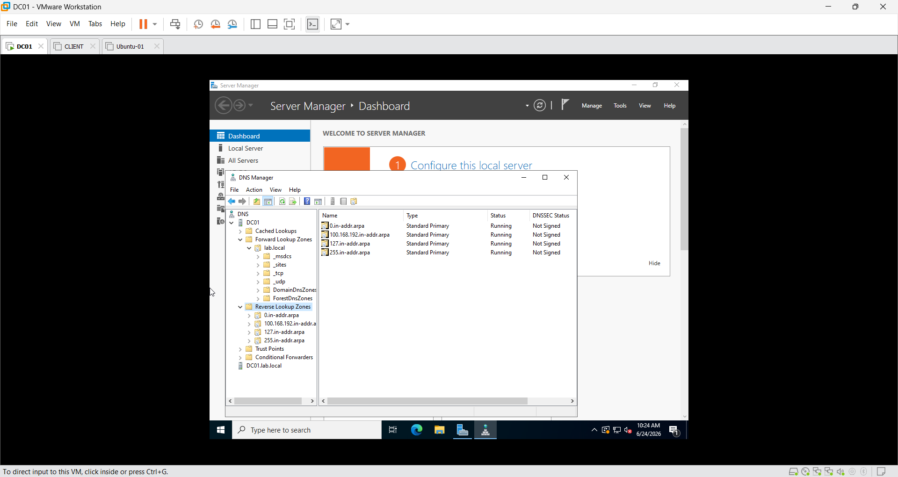 |
| DHCP Scope & Options | 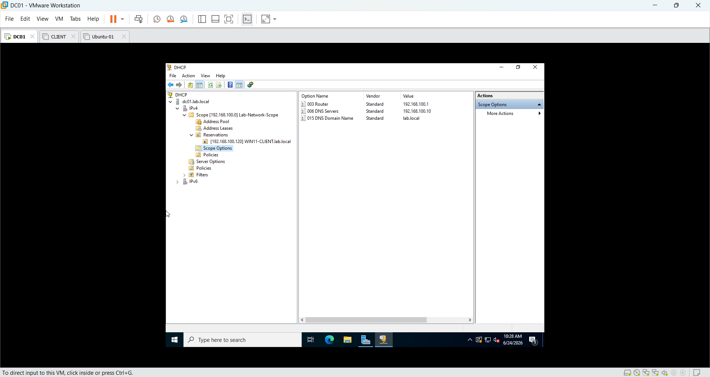 |
| Group Policy Management | 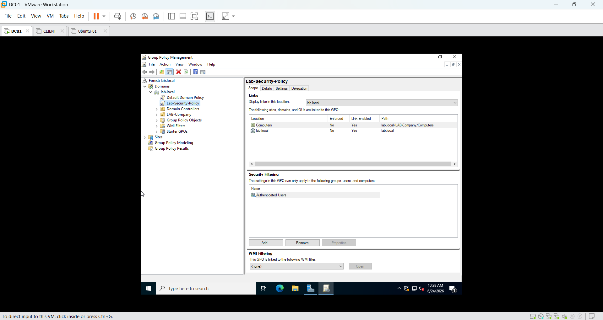 |
| PowerShell AD Verification (`Get-ADUser`) | 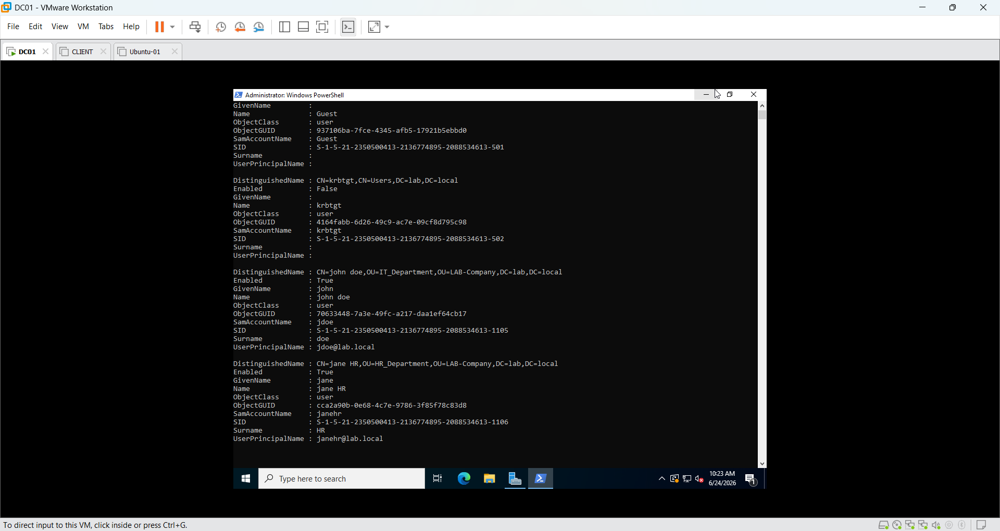 |
| PowerShell DNS Verification (`Get-DnsServerZone`) | 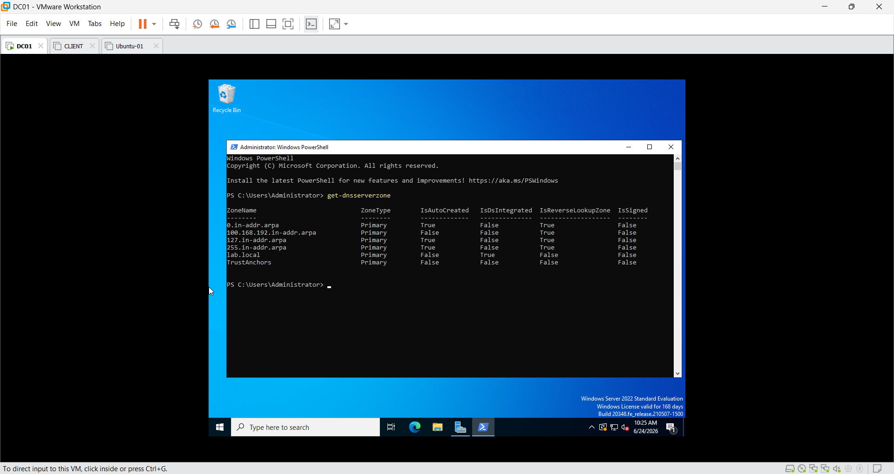 |
| PowerShell DHCP Verification (`Get-DhcpServerv4Scope`) | 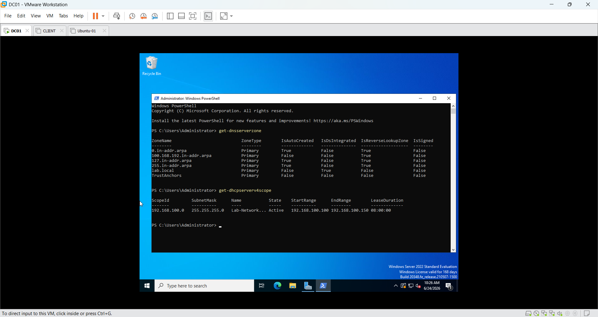 |
| Ubuntu Network Configuration (`ip a`) | 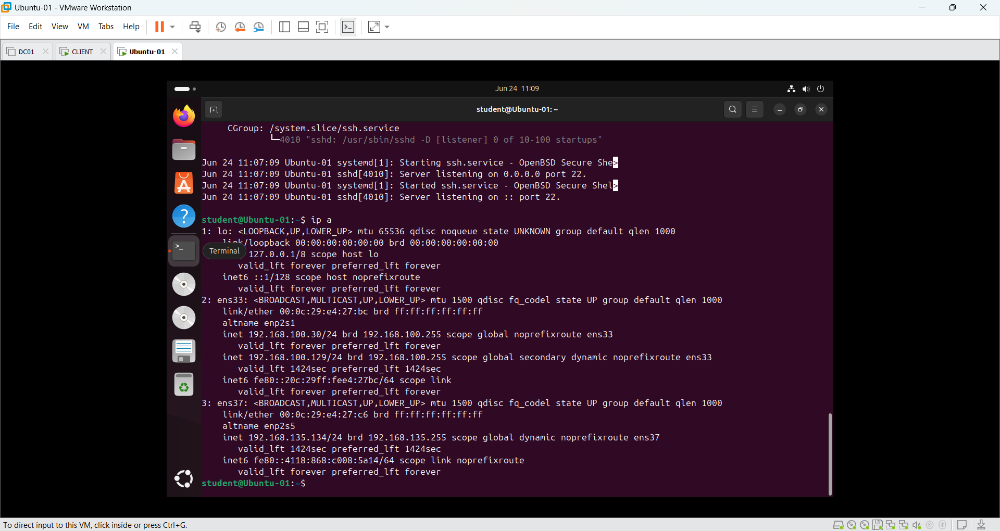 |
| Ubuntu SSH Service Status | 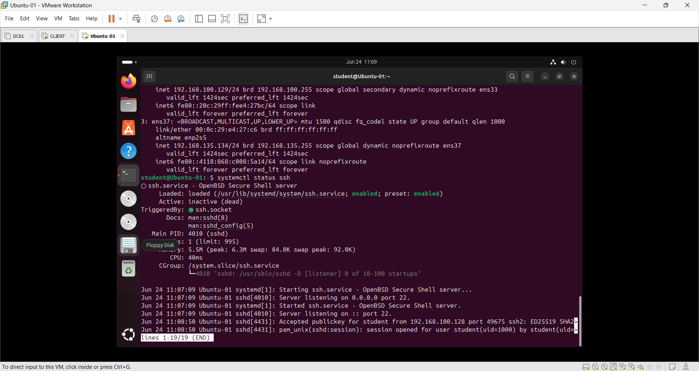 |
| SSH Login from Windows Client (Key Auth) | 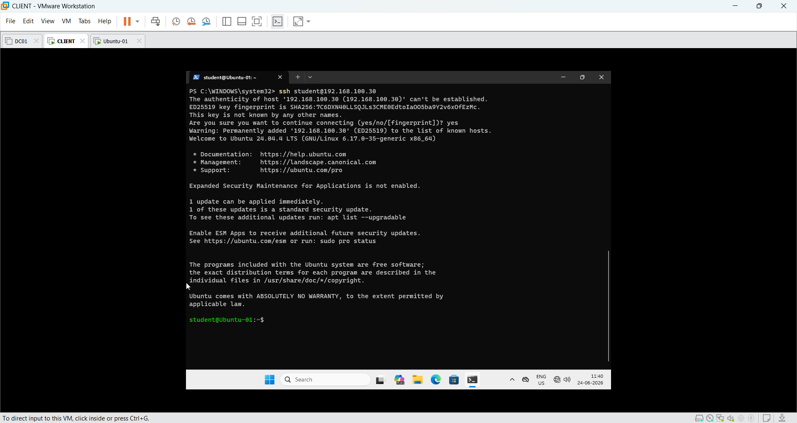 |
| Ubuntu Authorized Keys Proof | 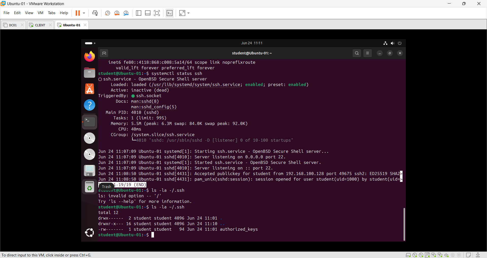 |

---

## 🧠 Skills Demonstrated

`Active Directory` · `AD DS` · `DNS` · `DHCP` · `Group Policy (GPO)` · `Windows Server 2022` · `Domain Controller` · `Windows 11 Administration` · `Ubuntu Server` · `Netplan` · `OpenSSH` · `ED25519 Key Authentication` · `SSH Hardening` · `PowerShell` · `VMware Workstation` · `Virtualisation` · `IT Infrastructure`

---

<div align="center">

*Built as a practical hands-on lab to simulate real enterprise IT infrastructure — combining Windows Server services with Linux administration and secure remote access.*

</div>
